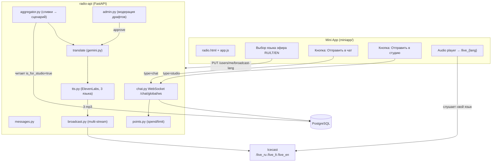
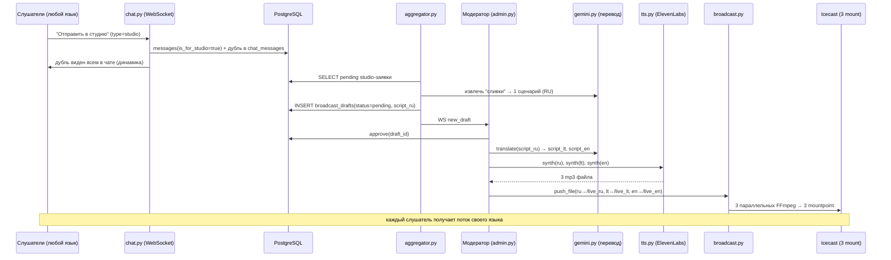

# Design Document: multilang-studio-broadcast

## Overview

Это **рефакторинг существующего проекта** «Sfera5 Radio» (FastAPI + PostgreSQL + WebSocket + JWT) в мультиязычную студию-вещание. Существующая архитектура (WebSocket-комнаты `ws_manager`, JWT-auth `dependencies`, асинхронный PostgreSQL `asyncpg`, конвейер ИИ-агрегация → `broadcast_drafts` → модератор → TTS → эфир) **сохраняется и не ломается**. Меняется бизнес-логика поверх неё.

Три ключевых изменения:

1. **Один общий эфир без выбора города.** Город (`city`) как единица комнаты остаётся в коде (для совместимости с `ws_manager`, `state`, таблицами), но фиксируется в единственный slug `global`. Выбор города из UI убирается. Вместо города пользователь выбирает **язык эфира**: `RU` / `LT` / `EN`.

2. **Поинты меняют смысл: reward → cost.** Сейчас любое действие *начисляет* баллы (`points.award`). После рефакторинга любое действие (сообщение в чат или в студию) *списывает* лимит (`points.spend`). Это инверсия существующей механики и должна быть выделена явно.

3. **Мультиязычный синхронный эфир.** Заявки людей на любом языке → ИИ собирает «сливки» → генерирует один сценарий (RU) → переводит на LT и EN через Gemini → ElevenLabs синтезирует 3 аудио → Icecast вещает 3 параллельных потока `/live_ru` `/live_lt` `/live_en` → пользователь слушает поток своего языка.

Терминологическое уточнение **языков** (решение заказчика зафиксировано):
- **Язык интерфейса и язык эфира СОВПАДАЮТ**: оба набора — `ru` / `lt` / `en`. Польский (`pl`) **полностью удаляется**.
- `users.language` (интерфейс) и `users.broadcast_lang` (эфир) хранятся отдельно, но оба ограничены множеством {ru, lt, en}. При выборе языка пользователем обновляются оба согласованно.
- Это упрощает UX: пользователь выбирает один язык — он применяется и к UI, и к звуку `/live_{lang}`.

**Бизнес-решения (утверждены заказчиком, закрывают Open Questions):**
1. **Поинты** начисляются **вручную администратором** (`POST /admin/points/add`); авто-сброса/авто-начисления НЕТ.
2. **Роли** меняются **вручную** (`POST /admin/users/{id}/role`); авто-повышение по баллам ОТКЛЮЧАЕТСЯ.
3. **Обычный чат — бесплатно** для всех ролей. **Студия** — только `aktivniy`+ и списывает поинты.
4. **Стоимость**: текст в студию = **1 поинт** (`COST_STUDIO=1`), голос в студию = **2 поинта** (`COST_STUDIO_VOICE=2`).
5. **Язык интерфейса = RU/LT/EN** (PL удалён).
6. **Бренд**: «Sfera5» → **«Radio AI»**.

---

## Architecture

### Высокоуровневая схема (после рефакторинга)



### Конвейер мультиязычного эфира (ядро, Шаг 3-4)



### Какие файлы меняются (карта рефакторинга)

| Файл | Изменение | Раздел |
|------|-----------|--------|
| `radio-api/db/schema.sql` | `messages.is_for_studio`, `messages.lang`; `broadcast_drafts` доп. колонки `script_lt`, `script_en`, `audio_ru/lt/en`; `users.broadcast_lang`; смысл `points_history` (cost) | Data Models |
| `radio-api/services/points.py` | `award()` → добавить `spend()` (списание + проверка лимита) | Низкоуровневый дизайн |
| `radio-api/services/tts.py` | edge-tts → ElevenLabs, мультиязычные голоса | Низкоуровневый дизайн |
| `radio-api/services/gemini.py` | + `translate(text, target_lang)` | Низкоуровневый дизайн |
| `radio-api/services/aggregator.py` | читать `is_for_studio`-заявки вместо всего чата; «сливки» | Низкоуровневый дизайн |
| `radio-api/services/broadcast.py` | multi-stream: mount по языку `/live_{lang}`, `push_files_multilang()` | Низкоуровневый дизайн |
| `radio-api/routers/chat.py` | `type=studio` обработчик; списание лимита | Низкоуровневый дизайн |
| `radio-api/routers/admin.py` | `approve_draft` → перевод + 3× TTS + 3× push | Низкоуровневый дизайн |
| `radio-api/routers/users.py` | `PUT /users/me/broadcast-lang`; убрать обяз. город | Components |
| `radio-api/state.py` | `stream_url(lang)`; mount `/live_{lang}` | Низкоуровневый дизайн |
| `radio-api/models.py` | `broadcast_lang`, `StudioMessageRequest`, draft с переводами | Data Models |
| `miniapp/radio.html` + `app.js` | 2 кнопки отправки, выбор языка эфира RU/LT/EN, URL потока по языку | Components |
| `miniapp/i18n.js` | добавить EN; убрать «Сфера5» из строк | Components |
| `telegram-bot/bot.py` | убрать «Sfera5» из имени/приветствий | Components |
| `icecast.xml` (инфра) | 3 mountpoint | Infra |
| `radio-host/main.py` | edge-tts → ElevenLabs (если `AI_AUTO_BROADCAST`); сейчас простаивает | Infra |

---

## Components and Interfaces

### Component 1: Выбор языка эфира (Frontend + users router)

**Назначение**: пользователь выбирает RU/LT/EN; выбор сохраняется и определяет URL Icecast-потока.

**Interface (backend)**:
```python
# routers/users.py
VALID_BROADCAST_LANGS = {"ru", "lt", "en"}

@router.put("/me/broadcast-lang", response_model=OkResponse)
async def update_broadcast_lang(payload: UpdateBroadcastLangRequest,
                                user: dict = Depends(get_current_user)) -> OkResponse: ...
```

**Interface (frontend)**:
```javascript
// app.js
const BROADCAST_LANGS = ["ru", "lt", "en"];
function streamUrlForLang(lang) { return `${RADIO_URL}/live_${lang}`; }
async function setBroadcastLang(lang) { /* PUT + переключить audio.src */ }
```

**Ответственности**:
- Хранит выбор в `localStorage` (`sfera5_broadcast_lang`) и в БД (`users.broadcast_lang`).
- При смене языка переключает `audio.src` на `/live_{lang}` без перезагрузки страницы.

### Component 2: Двойная кнопка отправки (Frontend + chat WS)

**Назначение**: внизу чата — поле ввода + микрофон, рядом две кнопки: «Отправить в чат» и «Отправить в студию».

**Interface (WebSocket-протокол)**:
```javascript
// type=chat   — обычное сообщение (только в общий чат)
ws.send(JSON.stringify({ type: "chat", message }));
// type=studio — заявка в студию (дубль в чат + is_for_studio=true)
ws.send(JSON.stringify({ type: "studio", message }));
```

**Ответственности**:
- `Отправить в чат` → `type=chat` → списание лимита `chat`, broadcast в комнату.
- `Отправить в студию` → `type=studio` → списание лимита `studio`, дубль в общий чат (видят все), запись `is_for_studio=true` для ИИ+модератора.
- Сервер заменяет старый `server_message` («Отправить на радио») на `studio` (переименование контракта).

### Component 3: ИИ-агрегатор «сливок» (aggregator.py)

**Назначение**: собрать studio-заявки на любых языках, выделить суть, сгенерировать единый сценарий (RU).

**Interface**:
```python
async def aggregate_studio(city: str = "global") -> dict | None:
    """Берёт messages(is_for_studio=true, status=pending), генерит script_ru."""
```

**Ответственности**:
- Источник теперь `messages` с `is_for_studio=true` (а не весь `chat_messages`).
- Промпт Gemini инструктирует: входы могут быть на RU/LT/EN; выдели общую суть; верни сценарий на русском.
- Создаёт `broadcast_drafts(status=pending, script=script_ru)`.

### Component 4: Перевод + мультиязычный TTS (gemini.py + tts.py)

**Назначение**: при одобрении модератором перевести сценарий и синтезировать 3 аудио.

**Interface**:
```python
# gemini.py
async def translate(text: str, target_lang: str) -> str: ...
# tts.py (ElevenLabs)
async def synthesize(text: str, out_path: str, lang: str = "ru") -> str: ...
async def synthesize_multilang(scripts: dict[str, str], out_dir: str) -> dict[str, str]:
    """scripts={'ru':..,'lt':..,'en':..} → {'ru': path, 'lt': path, 'en': path}"""
```

**Ответственности**:
- `translate` — Gemini, сохраняет тон/смысл, без пояснений.
- `tts` — абстракция провайдера: `TTS_PROVIDER=elevenlabs|edge`; голос по языку (`ELEVEN_VOICE_RU/LT/EN`).

### Component 5: Мультипоточный Icecast (broadcast.py + state.py)

**Назначение**: вещать 3 параллельных потока.

**Interface**:
```python
def mount_for(lang: str) -> str: return f"/live_{lang}"
def push_files_multilang(paths: dict[str, str]) -> dict[str, int]:
    """{'ru': mp3, 'lt': mp3, 'en': mp3} → код возврата FFmpeg по языку."""
```

**Ответственности**:
- 3 независимых FFmpeg-процесса (по одному на mount).
- `state.stream_url(lang)` возвращает `{RADIO_PUBLIC_URL}/live_{lang}`.

### Component 6: Модерация (admin.py)

**Назначение**: модератор видит все studio-заявки, одобряет тему → запускается Шаг 3 (перевод+TTS+эфир).

**Interface**: существующие `GET /admin/drafts`, `POST /admin/drafts/{id}/approve` сохраняются; `approve` расширяется до мультиязычного конвейера.

### Component 7: Ребрендинг (i18n.js, bot.py)

**Назначение**: убрать «Сфера5/Sfera5» из имени и приветствий.

**Ответственности**: заменить строки приветствий/onboarding; имя бренда в i18n; сообщения бота `/start`, `/help`, `/radio`, `/profile`.

---

## Data Models

### Изменения схемы (миграция, аддитивная — не ломает существующее)

```sql
-- messages: пометка "в студию" и язык исходной заявки
ALTER TABLE messages ADD COLUMN IF NOT EXISTS is_for_studio BOOLEAN DEFAULT false;
ALTER TABLE messages ADD COLUMN IF NOT EXISTS lang VARCHAR(5);  -- ru|lt|en|null(auto)
CREATE INDEX IF NOT EXISTS idx_messages_studio
    ON messages(is_for_studio, status, created_at DESC);

-- users: язык эфира (отдельно от users.language = язык интерфейса)
ALTER TABLE users ADD COLUMN IF NOT EXISTS broadcast_lang VARCHAR(5) DEFAULT 'ru';

-- broadcast_drafts: переводы и аудио по языкам
ALTER TABLE broadcast_drafts ADD COLUMN IF NOT EXISTS script_lt TEXT;
ALTER TABLE broadcast_drafts ADD COLUMN IF NOT EXISTS script_en TEXT;
ALTER TABLE broadcast_drafts ADD COLUMN IF NOT EXISTS audio_ru VARCHAR(500);
ALTER TABLE broadcast_drafts ADD COLUMN IF NOT EXISTS audio_lt VARCHAR(500);
ALTER TABLE broadcast_drafts ADD COLUMN IF NOT EXISTS audio_en VARCHAR(500);
```

**Смысл `points`/`points_history` (cost-модель)** _(Requirements 4, 5, 12)_:
- `points` теперь = остаток лимита (баланс, который тратится), а не накопленный рейтинг.
- `points_history.amount` для трат — **отрицательное** значение; `event_type` ∈ `{studio, studio_voice}` для списаний (старые `appeal/chat/listen/admin` остаются для истории/начислений).
- **Обычный чат — бесплатно** (Req 4): за `type=chat` поинты НЕ списываются и НЕ начисляются.
- **Студия** (Req 5): только роль `aktivniy`+; текст = 1 поинт, голос = 2 поинта.
- Начисление поинтов — **только вручную админом** (`POST /admin/points/add`, Req 12). Нет авто-сброса.
- Авто-повышение роли (`points._maybe_promote`) **ОТКЛЮЧАЕТСЯ** — роли меняются вручную (Req 12.3).

**Validation Rules**:
- `broadcast_lang ∈ {ru, lt, en}` (Req 1.5).
- `language (интерфейс) ∈ {ru, lt, en}` — `pl` удалён (Req 1.6).
- `messages.lang ∈ {ru, lt, en} ∪ {null}`.
- `points >= 0` всегда (списание не уводит в минус, Req 5.5).

### Pydantic-модели (models.py)

```python
class UpdateBroadcastLangRequest(BaseModel):
    broadcast_lang: str  # ru | lt | en

class StudioMessageRequest(BaseModel):
    message: str

class DraftOut(BaseModel):  # расширение существующей
    id: int
    main_topic: Optional[str] = None
    source_count: int = 0
    script: str            # RU
    script_lt: Optional[str] = None
    script_en: Optional[str] = None
    status: str
    created_at: datetime
```

---

## Algorithmic Pseudocode (Low-Level Design)

Языки реальные (проект на Python/JS). Формальные спецификации даны для ключевых функций.

### Функция: points.spend() — инверсия reward→cost

```python
async def spend(user_id: int, event_type: str, cost: int) -> dict:
    """Списывает лимит за действие. Атомарно, без ухода в минус."""
```

**Preconditions**:
- `user_id` существует в `users`.
- `event_type ∈ {"chat", "studio"}`.
- `cost > 0`.

**Postconditions**:
- Если `points >= cost`: `points` уменьшается на `cost`, в `points_history` пишется `amount = -cost`, возвращается `{ok: true, points: новый_остаток}`.
- Если `points < cost`: состояние НЕ меняется, возвращается `{ok: false, points: текущий, reason: "insufficient_limit"}`.
- Никогда не оставляет `points < 0`.

**Loop Invariants**: N/A (атомарный UPDATE с условием).

```python
COST = {"studio": int(os.getenv("COST_STUDIO", "1")),
        "studio_voice": int(os.getenv("COST_STUDIO_VOICE", "2"))}
# Обычный чат (type=chat) — БЕСПЛАТНО, spend() для него не вызывается.

async def spend(user_id: int, event_type: str, cost: int) -> dict:
    row = await db.fetchrow(
        """
        UPDATE users SET points = points - $2
        WHERE id = $1 AND points >= $2
        RETURNING points
        """,
        user_id, cost,
    )
    if row is None:
        cur = await db.fetchval("SELECT points FROM users WHERE id = $1", user_id)
        return {"ok": False, "points": int(cur or 0), "reason": "insufficient_limit"}
    await db.execute(
        "INSERT INTO points_history (user_id, event_type, amount) VALUES ($1,$2,$3)",
        user_id, event_type, -cost,
    )
    return {"ok": True, "points": row["points"]}
```

### Функция: chat.py — обработка type=chat и type=studio

```python
async def handle_incoming(ws, user, city, data) -> None:
    """Маршрутизирует входящее WS-сообщение: chat | studio."""
```

**Preconditions**:
- `user` аутентифицирован, член сообщества (проверено при connect).
- `data["type"] ∈ {"chat", "studio", "ping"}`.

**Postconditions**:
- `chat`: при успешном списании лимита `chat` — сообщение сохранено в `chat_messages` и разослано в комнату; при нехватке лимита — отправлен `{type:"limit_exceeded"}`, сообщение НЕ сохранено.
- `studio`: при успешном списании лимита `studio` — (а) дубль в `chat_messages` + broadcast в комнату; (б) запись в `messages(is_for_studio=true, status=pending, lang=?)`; при нехватке лимита — `{type:"limit_exceeded"}`, ничего не сохранено.

**Loop Invariants**: N/A.

```python
# type=chat — БЕСПЛАТНО (Req 4), без проверки роли и без spend()
elif msg_type == "chat":
    text = (data.get("message") or "").strip()
    if not text:
        return
    row = await db.fetchrow(
        "INSERT INTO chat_messages (user_id, city, message) VALUES ($1,$2,$3) RETURNING created_at",
        user["id"], city, text)
    await manager.broadcast(city, {"type": "chat", "data": {
        "username": display_name(user), "message": text,
        "created_at": row["created_at"].isoformat()}})

# type=studio — только aktivniy+ (Req 5.1), списывает 1 поинт (Req 5.2)
elif msg_type == "studio":
    text = (data.get("message") or "").strip()
    if not text:
        return
    if ROLE_LEVELS.get(user["role"], 0) < ROLE_LEVELS["aktivniy"]:
        await ws.send_json({"type": "studio_denied", "data": {"reason": "role"}})
        return
    spent = await points.spend(user["id"], "studio", points.COST["studio"])
    if not spent["ok"]:
        await ws.send_json({"type": "limit_exceeded",
                            "data": {"event": "studio", "points": spent["points"]}})
        return
    # (а) дубль в общий чат — динамика, видят все (Req 6.1)
    row = await db.fetchrow(
        "INSERT INTO chat_messages (user_id, city, message) VALUES ($1,$2,$3) RETURNING created_at",
        user["id"], city, text)
    await manager.broadcast(city, {"type": "chat", "data": {
        "username": display_name(user), "message": text,
        "created_at": row["created_at"].isoformat()}})
    # (б) пометка для ИИ + модератора (Req 6.2)
    await db.execute(
        "INSERT INTO messages (user_id, city, text, status, is_for_studio, lang) "
        "VALUES ($1,$2,$3,'pending',true,$4)",
        user["id"], city, text, data.get("lang"))
    await ws.send_json({"type": "studio_ack", "data": {"points": spent["points"]}})
```

### Функция: aggregator.aggregate_studio() — «сливки»

```python
async def aggregate_studio(city: str = "global") -> dict | None:
    """Собирает studio-заявки (любой язык) → 1 сценарий (RU) → draft."""
```

**Preconditions**:
- Есть `>= MIN_STUDIO` заявок в `messages(is_for_studio=true, status=pending)`.

**Postconditions**:
- Заявки помечены `status='approved'` (потреблены, не переиспользуются).
- Создан `broadcast_drafts(status='pending', script=script_ru, main_topic)`.
- Возвращён dict драфта; модераторам разослан WS `new_draft`.
- Если заявок меньше порога — возвращает `None`, состояние не меняется.

**Loop Invariants**:
- На каждой итерации сборки пула все ранее добавленные заявки остаются в множестве «к потреблению» (их id фиксируются до генерации, чтобы не потерять/не задвоить).

```python
AGGREGATE_STUDIO_PROMPT = """Ты редактор радиоэфира.
Ниже — заявки слушателей (могут быть на русском, литовском или английском):

{messages}

Задача: выдели ОБЩУЮ суть ("сливки") и напиши ОДИН сценарий диктора.
Правила: не отвечай каждому лично; обобщай; 100-160 слов; ТОЛЬКО на русском языке.
Верни JSON: {{"main_topic": "...", "script": "..."}}"""
```

### Функция: admin.approve_draft() — мультиязычный конвейер

```python
async def approve_draft(draft_id: int, admin: dict) -> OkResponse:
    """approve → translate(LT,EN) → 3× TTS → 3× Icecast push."""
```

**Preconditions**:
- Драфт существует и `status == 'pending'`.
- `script` (RU) непустой.

**Postconditions**:
- `script_lt`, `script_en` заполнены (через Gemini); при сбое перевода — фолбэк на RU-текст для этого языка (эфир не падает).
- Сгенерированы до 3 mp3 (`audio_ru/lt/en`).
- Драфт → `status='approved'`, в `broadcasts` запись.
- При `USE_ICECAST=true` — каждый mp3 запушен в свой mount `/live_{lang}`.
- Слушателям разослан WS `new_segment` с per-lang URL.
- При сбое одного языка остальные продолжают (частичный успех логируется).

**Loop Invariants**:
- Для цикла по языкам `["ru","lt","en"]`: после обработки k-го языка готово ровно k аудио (или зафиксированы k ошибок); никакой язык не обрабатывается дважды.

```python
LANGS = ["ru", "lt", "en"]

async def approve_draft(draft_id, admin):
    draft = await db.fetchrow("SELECT * FROM broadcast_drafts WHERE id=$1", draft_id)
    assert draft and draft["status"] == "pending"
    scripts = {"ru": draft["script"]}
    # перевод
    for lang in ("lt", "en"):
        try:
            scripts[lang] = await gemini.translate(draft["script"], lang)
        except Exception:
            scripts[lang] = draft["script"]  # фолбэк
    # TTS (ElevenLabs) — 3 файла
    out_dir = os.path.join(AUDIO_DIR, draft["city"])
    paths = await tts.synthesize_multilang(scripts, out_dir)  # {lang: mp3_path}
    # БД: переводы + аудио + статус
    await db.execute("""UPDATE broadcast_drafts SET status='approved',
        script_lt=$2, script_en=$3, audio_ru=$4, audio_lt=$5, audio_en=$6,
        moderator_id=$7, decided_at=NOW() WHERE id=$1""",
        draft_id, scripts["lt"], scripts["en"],
        basename(paths.get("ru")), basename(paths.get("lt")), basename(paths.get("en")),
        admin["telegram_id"])
    # Icecast: push в 3 mount
    if broadcast.is_available():
        asyncio.create_task(asyncio.to_thread(broadcast.push_files_multilang, paths))
    # уведомить слушателей (per-lang URL)
    for lang, p in paths.items():
        await manager.broadcast(draft["city"], {"type": "new_segment", "data": {
            "lang": lang, "url": f"/radio/audio/{draft['city']}/{basename(p)}",
            "script": scripts[lang]}})
    return OkResponse(detail={"draft_id": draft_id, "status": "approved"})
```

### Функция: broadcast.push_files_multilang() — multi-stream Icecast

```python
def push_files_multilang(paths: dict[str, str]) -> dict[str, int]:
    """Пушит mp3 каждого языка в свой mount /live_{lang}. Возвращает коды возврата."""
```

**Preconditions**:
- `USE_ICECAST == true`.
- `paths` содержит существующие mp3 для подмножества {ru, lt, en}.

**Postconditions**:
- Для каждого языка запущен FFmpeg → `icecast://.../live_{lang}`.
- Возвращён `{lang: returncode}`; код != 0 означает сбой конкретного потока, остальные не затронуты.

**Loop Invariants**:
- После k итераций ровно k потоков инициировано; множество обработанных языков растёт строго монотонно.

```python
def push_files_multilang(paths: dict[str, str]) -> dict[str, int]:
    results = {}
    for lang, mp3 in paths.items():
        mount = f"/live_{lang}"
        url = f"icecast://source:{ICECAST_PASS}@{ICECAST_HOST}:{ICECAST_PORT}{mount}"
        cmd = [_ffmpeg_bin(), "-re", "-i", mp3, "-c:a", "libmp3lame",
               "-b:a", "128k", "-ar", "44100", "-ac", "2",
               "-content_type", "audio/mpeg", "-f", "mp3", url]
        results[lang] = subprocess.run(cmd, stdout=subprocess.DEVNULL,
                                       stderr=subprocess.PIPE).returncode
    return results
```

### Функция: tts.synthesize() — ElevenLabs с абстракцией

```python
async def synthesize(text: str, out_path: str, lang: str = "ru") -> str:
    """Синтез через ElevenLabs (или edge-tts фолбэк). Голос по языку."""
```

**Preconditions**:
- `text` непустой; `lang ∈ {ru, lt, en}`.
- Если `TTS_PROVIDER=elevenlabs` — задан `ELEVENLABS_API_KEY`.

**Postconditions**:
- По пути `out_path` создан валидный mp3.
- При сбое ElevenLabs и `TTS_FALLBACK_EDGE=true` — используется edge-tts (сохранение работоспособности).

```python
TTS_PROVIDER = os.getenv("TTS_PROVIDER", "elevenlabs")
ELEVEN_VOICES = {"ru": os.getenv("ELEVEN_VOICE_RU", ""),
                 "lt": os.getenv("ELEVEN_VOICE_LT", ""),
                 "en": os.getenv("ELEVEN_VOICE_EN", "")}
EDGE_VOICES = {"ru": "ru-RU-DmitryNeural", "lt": "lt-LT-LeonasNeural",
               "en": "en-US-GuyNeural"}

async def synthesize(text: str, out_path: str, lang: str = "ru") -> str:
    if TTS_PROVIDER == "elevenlabs" and os.getenv("ELEVENLABS_API_KEY"):
        try:
            return await _eleven_synth(text, out_path, ELEVEN_VOICES[lang])
        except Exception:
            if os.getenv("TTS_FALLBACK_EDGE", "true") != "true":
                raise
    import edge_tts
    await edge_tts.Communicate(text, EDGE_VOICES[lang]).save(out_path)
    return out_path
```

---

## Example Usage

### Frontend: выбор языка эфира и две кнопки

```javascript
// Выбор языка эфира
document.querySelectorAll(".broadcast-lang-pill").forEach((b) => {
    b.addEventListener("click", () => setBroadcastLang(b.dataset.lang));
});
async function setBroadcastLang(lang) {
    localStorage.setItem("sfera5_broadcast_lang", lang);
    await fetch(`${API_URL}/users/me/broadcast-lang`, {
        method: "PUT",
        headers: { "Content-Type": "application/json", ...authHeaders() },
        body: JSON.stringify({ broadcast_lang: lang }),
    });
    audio.src = streamUrlForLang(lang);   // переключаем поток без перезагрузки
    if (isPlaying) audio.play().catch(() => {});
}

// Две кнопки отправки
document.getElementById("sendChatBtn").addEventListener("click", () => sendMessage("chat"));
document.getElementById("sendStudioBtn").addEventListener("click", () => sendMessage("studio"));
function sendMessage(kind) {
    const text = chatInput.value.trim();
    if (!text) return;
    ws.send(JSON.stringify({ type: kind, message: text,
                             lang: localStorage.getItem("sfera5_broadcast_lang") }));
    chatInput.value = "";
    showToast(kind === "studio" ? t("toast_sent_studio") : t("toast_sent_chat"));
}
```

### Frontend: обработка нехватки лимита

```javascript
ws.onmessage = (event) => {
    const data = JSON.parse(event.data);
    if (data.type === "limit_exceeded") {
        showToast(t("toast_limit"));      // "Лимит исчерпан"
        document.getElementById("points").textContent = data.data.points;
    } else if (data.type === "new_segment") {
        if (data.data.lang === currentBroadcastLang()) handleNewSegment(data.data);
    }
    // ... existing chat / presence / role_up
};
```

---

## Correctness Properties

### Property 1: Баланс лимита неотрицателен
∀ действие a (studio): после `spend` выполняется `points >= 0`.
Тестируемость: property-based (Hypothesis) — произвольные последовательности действий и стартовые балансы.
**Validates: Requirements 5.5**

### Property 2: Studio-заявка одновременно публична и помечена
∀ studio-заявка m: m появляется в общем чате И помечена `is_for_studio=true` (оба эффекта вместе, либо ничего при нехватке лимита).
Тестируемость: example-based + интеграционный (WS + БД).
**Validates: Requirements 6.1, 6.2**

### Property 3: При нехватке лимита состояние БД неизменно
Если `points < cost`, то ни `chat_messages`, ни `messages`, ни `points` не меняются.
Тестируемость: property-based (Hypothesis) с транзакционным откатом/моками.
**Validates: Requirements 5.4**

### Property 4: Не более 3 потоков, каждый язык — однократно
∀ одобренный драфт: число сгенерированных потоков ≤ 3 и каждый язык {ru,lt,en} обрабатывается не более одного раза.
Тестируемость: example-based с мок-провайдерами.
**Validates: Requirements 11.1**

### Property 5: Изоляция сбоев по языкам
Сбой перевода/TTS одного языка не блокирует остальные (частичная доступность эфира).
Тестируемость: example-based — один язык-провайдер бросает исключение.
**Validates: Requirements 9.3, 10.4, 11.4**

### Property 6: Слушатель получает поток своего языка
∀ пользователь u: слушаемый поток = `/live_{u.broadcast_lang}` (суть эфира одна, потоки изолированы).
Тестируемость: example-based (UI/стейт).
**Validates: Requirements 11.3**

### Property 7: Валидация языка эфира
`broadcast_lang ∈ {ru,lt,en}`; недопустимые значения отвергаются с HTTP 400.
Тестируемость: property-based (Hypothesis) — произвольные строки.
**Validates: Requirements 1.5**

### Property 8: Идемпотентность списания на сообщение
Одно WS-сообщение списывает лимит ровно один раз.
Тестируемость: property-based (Hypothesis) — повторы/гонки.
**Validates: Requirements 5.6**

---

## Error Handling

### Сценарий 1: Недостаточно лимита (Поинты)
**Условие**: `points < cost` при chat/studio.
**Ответ**: WS `{type:"limit_exceeded", data:{points}}`; сообщение не сохраняется.
**Восстановление**: фронт показывает тост и актуальный баланс; пользователь ждёт пополнения (механика начисления лимита — Open Questions).

### Сценарий 2: Сбой перевода (Gemini)
**Условие**: `gemini.translate` бросает исключение/таймаут.
**Ответ**: фолбэк — для проблемного языка используется RU-текст; логируется warning.
**Восстановление**: эфир выходит, перевод можно догенерировать вручную через `PUT /admin/drafts/{id}`.

### Сценарий 3: Сбой ElevenLabs TTS
**Условие**: ошибка API/квоты ElevenLabs.
**Ответ**: при `TTS_FALLBACK_EDGE=true` — edge-tts; иначе 500 на approve.
**Восстановление**: модератор повторяет approve после восстановления квоты.

### Сценарий 4: Падение одного Icecast-потока
**Условие**: FFmpeg returncode != 0 для одного mount.
**Ответ**: остальные потоки продолжают; код возврата залогирован.
**Восстановление**: повторный push конкретного языка.

### Сценарий 5: Несовместимость старого контракта `server_message`
**Условие**: старый клиент шлёт `type=server_message`.
**Ответ**: сервер маппит `server_message` → `studio` на переходный период (обратная совместимость).
**Восстановление**: после обновления клиента маппинг удаляется.

---

## Testing Strategy

### Unit Testing
- `points.spend`: достаточный/недостаточный баланс, граница `points == cost`, гонки (атомарный UPDATE).
- `gemini.translate`: парсинг ответа, фолбэк.
- `tts.synthesize`: выбор провайдера, фолбэк на edge.
- `broadcast.mount_for` / `push_files_multilang`: формирование mount/URL.

### Property-Based Testing
**Библиотека**: Hypothesis (Python, проект на Python).
- Инвариант неотрицательности баланса при произвольных последовательностях chat/studio.
- Идемпотентность списания на одно сообщение.
- При нехватке лимита БД-состояние неизменно (через мок/транзакционный откат).

### Integration Testing
- WS end-to-end: `studio` → дубль в чате + запись `is_for_studio` → агрегатор создаёт драфт → approve → 3 аудио (мок Icecast).
- `PUT /users/me/broadcast-lang` → `/radio/status` отдаёт корректный `stream_url` для языка.

---

## Performance Considerations

- Перевод (2 вызова Gemini) + 3× TTS выполняются при approve — операция модератора, не на горячем пути слушателя; запускать TTS/перевод конкурентно (`asyncio.gather`) для снижения латентности.
- 3 FFmpeg-процесса на эфир — нагрузка CPU ×3 против одного потока; учитывать при сайзинге сервера Icecast.
- Списание лимита — один атомарный `UPDATE ... WHERE points >= cost`, без блокировок на чтение.

## Security Considerations

- JWT-auth и проверка членства в сообществе (`membership`) сохраняются на всех WS/HTTP путях — не ослабляются.
- `broadcast_lang` валидируется по белому списку (защита от инъекции в URL потока/mount).
- Mount-имена `/live_{lang}` строятся только из валидированного белого списка языков (никакого пользовательского ввода в shell-команду FFmpeg).
- ElevenLabs API-ключ — только из env, не логируется.
- Icecast `source` пароль — из env (`ICECAST_PASS`), не хардкодится.

## Dependencies

- **ElevenLabs**: HTTP API (`elevenlabs` SDK или прямой `httpx`); env `ELEVENLABS_API_KEY`, `ELEVEN_VOICE_RU/LT/EN`.
- **edge-tts**: остаётся как фолбэк-провайдер.
- **Gemini** (`google-generativeai`): уже есть; добавляется `translate`.
- **Icecast**: конфиг `icecast.xml` с 3 mountpoint (`/live_ru`, `/live_lt`, `/live_en`); FFmpeg (`imageio-ffmpeg` фолбэк уже есть).
- **PostgreSQL/asyncpg**: миграция аддитивных колонок.

### Пример icecast.xml (фрагмент, инфраструктура)

```xml
<mount><mount-name>/live_ru</mount-name><public>1</public></mount>
<mount><mount-name>/live_lt</mount-name><public>1</public></mount>
<mount><mount-name>/live_en</mount-name><public>1</public></mount>
```

### Новые переменные окружения (.env)

```
TTS_PROVIDER=elevenlabs
ELEVENLABS_API_KEY=...
ELEVEN_VOICE_RU=...
ELEVEN_VOICE_LT=...
ELEVEN_VOICE_EN=...
TTS_FALLBACK_EDGE=true
COST_STUDIO=1
COST_STUDIO_VOICE=2
BRAND_NAME=Radio AI
```

---

## Resolved Decisions (бывшие Open Questions — закрыты заказчиком)

1. **Пополнение поинтов**: только вручную админом через `POST /admin/points/add`. Авто-сброса нет.
2. **Роли**: меняются вручную (`POST /admin/users/{id}/role`). Авто-повышение по баллам отключено.
3. **Польский (pl)**: удалён. Интерфейс и эфир — RU/LT/EN.
4. **Язык заявки `messages.lang`**: берётся из выбранного пользователем языка эфира (`broadcast_lang`).
5. **Стоимость голосовой заявки**: 2 поинта (текст = 1 поинт).
6. **Бренд**: «Radio AI» вместо «Sfera5».
